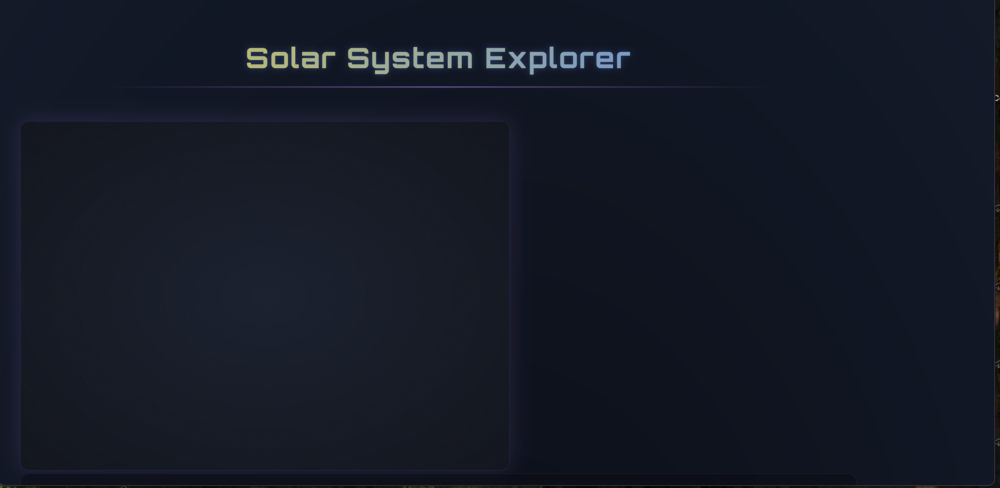

# Solar System Explorer - Progressive Web App (PWA)



An interactive educational Progressive Web App that lets users explore our solar system with visual representations, detailed information, and audio narrations.

## Features

- 🚀 **Interactive Solar System Visualization**: Beautiful canvas rendering of planets in orbit
- 📱 **PWA Ready**: Installable on devices and works offline
- 🔊 **Audio Narration**: Learn about each planet with audio descriptions
- 📊 **Educational Content**: Detailed information about each celestial body
- 🔍 **Responsive Design**: Works on mobile, tablet, and desktop
- ⚡ **Fast Loading**: Service worker caches all assets for quick loading

## Technologies Used

- HTML5
- CSS3 (with Bootstrap 5)
- JavaScript (Canvas API, Web Audio API)
- Progressive Web App technologies (Service Workers, Web App Manifest)

## Installation

### Option 1: Install as PWA
1. Visit the live website in Chrome/Edge
2. Click the "Install App" button when prompted
3. Confirm installation

### Option 2: Local Development
1. Clone this repository:
   ```bash
   git clone https://github.com/yourusername/solar-system-pwa.git
